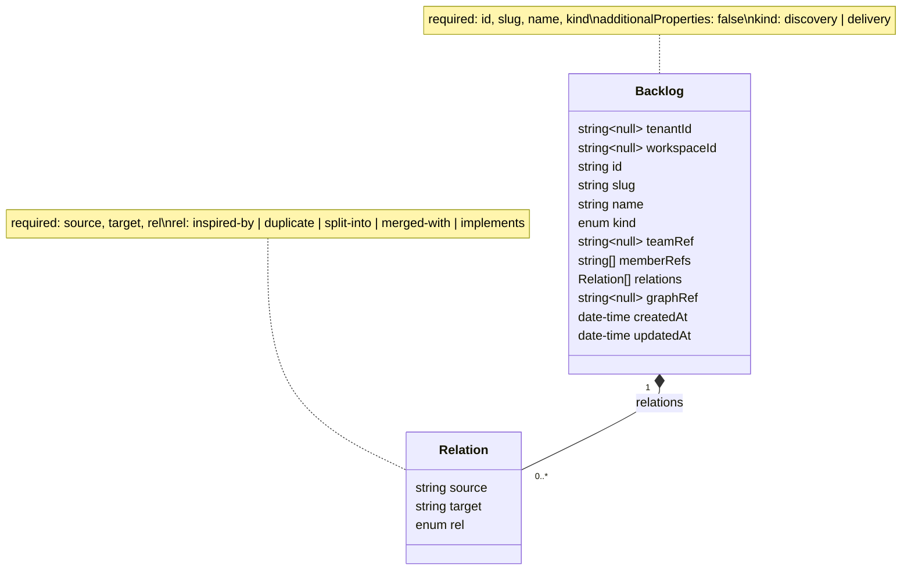
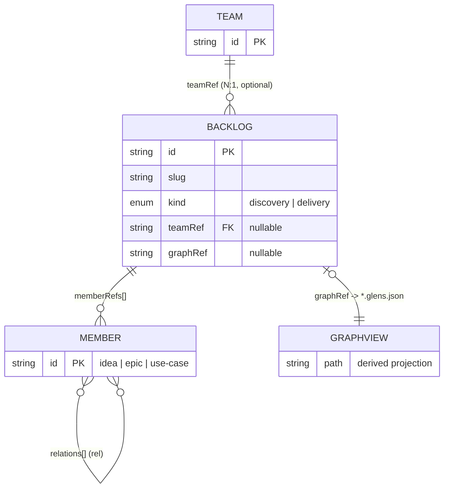
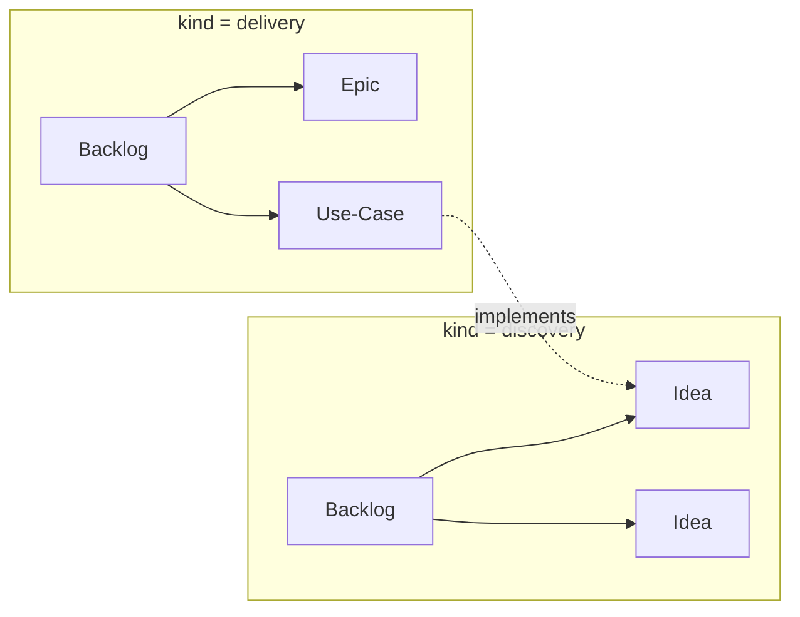

# Backlog schema

Visual companion to [`backlog.schema.json`](backlog.schema.json) (`$version` 1.0.0,
Opportunity Management v2.1). See the [schema set overview](README.md#opportunity-management-v2)
for the surrounding model.

A **Backlog** is a first-class collection inside a venture. `backlogs/` sits at the
**same level** as `teams/` — a backlog is not owned by a team but may reference one
via `teamRef` (N:1, optional). A `discovery` backlog collects **ideas**; a
`delivery` backlog collects **epics / use-cases**. This document holds the backlog's
own metadata + membership; the node/link graph is a derived GraphView projection
(`*.glens.json`, #011) pointed to by `graphRef`.

## Object shape

## Relationships to other entities

Refs point from the backlog to stable/asset or registry entities; `memberRefs`
holds ideas (discovery) or epics/use-cases (delivery). The team link is indirect
(epic → backlog → team).

## `kind` → member type

## Field reference

| Field | Type | Required | Notes |
| ----- | ---- | :------: | ----- |
| `tenantId` | string \| null | | Reserved for future multi-tenant SaaS layer; null in local store |
| `workspaceId` | string \| null | | Reserved workspace scope; null in local store |
| `id` | string | ✅ | Stable unique backlog id |
| `slug` | string | ✅ | Filesystem-friendly; also the `<slug>.backlog.json` filename stem |
| `name` | string | ✅ | Human-readable backlog name |
| `kind` | enum | ✅ | `discovery` (ideas) \| `delivery` (epics/use-cases) |
| `teamRef` | string \| null | | Owning team id (N:1); null when shared or team-less |
| `memberRefs` | string[] (unique) | | Member entity ids (ideas, or epics/use-cases) |
| `relations` | Relation[] | | Member-to-member relations, mirrored into GraphView |
| `graphRef` | string \| null | | Relative path to the derived `<slug>.glens.json` projection |
| `createdAt` | date-time | | Creation timestamp (ISO 8601) |
| `updatedAt` | date-time | | Last-modified timestamp (ISO 8601) |

### Relation object

| Field | Type | Required | Notes |
| ----- | ---- | :------: | ----- |
| `source` | string | ✅ | Source member id |
| `target` | string | ✅ | Target member id |
| `rel` | enum | ✅ | `inspired-by` \| `duplicate` \| `split-into` \| `merged-with` \| `implements` (use-case → idea) |
